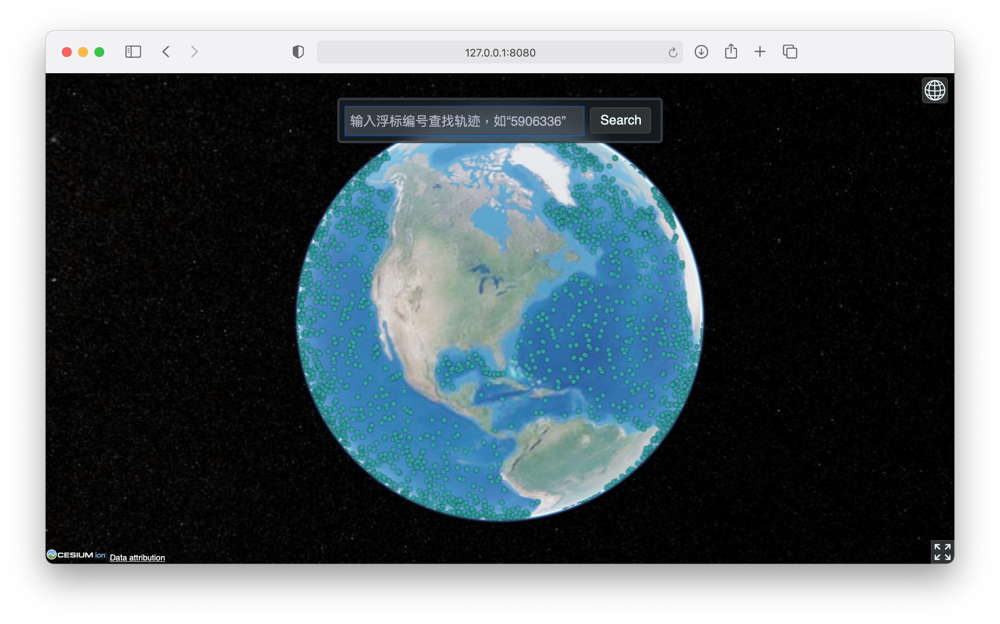
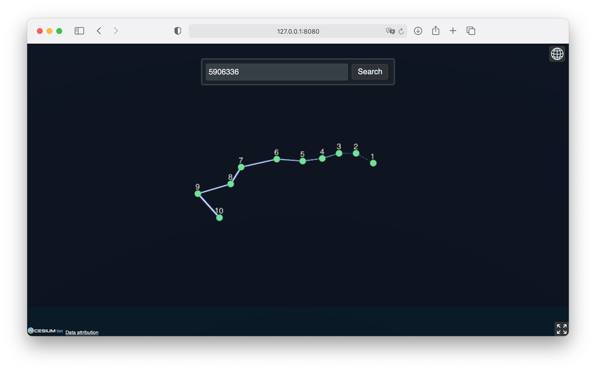
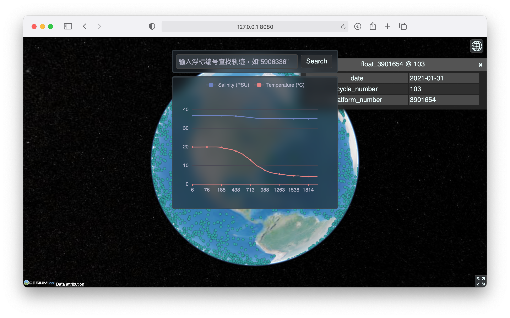

# ArgoBox

A simple Argo data viewer. Both front-end and back-end are included.

*Final project for GISAppDev course (2021 Spring)*

## Screen Shots

## Notice

Web server listens on the hard-coded address which is `0.0.0.0:8080`, and database connection information is also written directly into the sourcecode. This is bogus, but since I did not have enough time during the end-term exam weeks, this temporary solution was implemented. For this reason, if you are attempting to run ArgoBox on your local machine, you may need to adjust these settings in the sourcecode.

## Credit

* Argo data were collected and made freely available by the International Argo Program and the national programs that contribute to it.  (https://argo.ucsd.edu,  https://www.ocean-ops.org).  The Argo Program is part of the Global Ocean Observing System.
